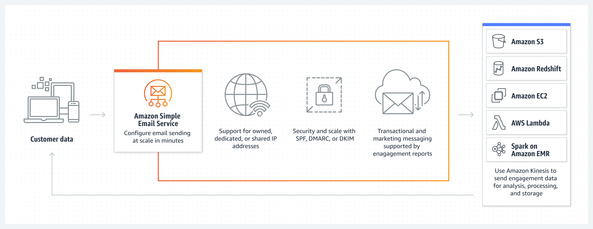

# Лабораторная работа 1 (Amazon) - 3 вариант

Мартынюк Алексей (ППА1)

## Цель

Знакомство с наиболее популярными облачными сервисами и их Российскими аналогами, изучение возможностей для миграции на отчественные платформы. Понимание уровней абстрации над инфраструктурой в облаке.

## Предупреждение

Многие (читать: большинство) из представленых описаний и иллюстраций взяты (и переведены) с официальных страниц соответствующих сервисов, в особенности с [aws.amazon.com](asw.amazon.com)

## Сервисы AWS

**AmazonElastiCache** - это сервис кэширования, совместимый с Redis и Memcached, обеспечивающий оптимизированную с точки зрения затрат производительность в режиме реального времени для современных приложений. ElastiCache масштабируется до сотен миллионов операций в секунду с микросекундным временем отклика и обеспечивает безопасность и надежность корпоративного уровня. Основные use cases:
1. Снижение общей стоимости владения за счет уменьшения нагрузки на серверную базу данных
2. Кэширование данных приложения в режиме реального времени
3. Хранение сеансов в реальном времени (для игр, электронной коммерции, социальных сетей и онлайн-приложений с микросекундным временем отклика)

**Amazon OpenSearch Service (бывший AmazonES)** - сервис, который позволяет легко выполнять интерактивную аналитику журналов, мониторинг приложений в режиме реального времени, поиск по веб-сайтам и многое другое. OpenSearch - это пакет распределенного поиска и аналитики с открытым исходным кодом, производный от Elasticsearch. Сервис Amazon OpenSearch предлагает последние версии OpenSearch, поддержку 19 версий Elasticsearch (версии с 1.5 по 7.10), а также возможности визуализации, основанные на инструментальных панелях OpenSearch и Kibana (версии с 1.5 по 7.10). Сервис Amazon OpenSearch в настоящее время насчитывает десятки тысяч активных клиентов с сотнями тысяч кластеров под управлением, обрабатывающих сотни триллионов запросов в месяц.

**AmazonQLDB** - сервис для ведения неизменяемого, криптографически проверяемого журнала изменений данных (например, для хранения истории финансовых транзакций)

**awskms** - сервис, который позволяет создавать криптографические ключи и управлять ими для создания и проверки цифровой подписи, шифровки и расшифровки данных и проверки подлинности сообщений.

**CloudHSM** - сервис, который позволяет обспечивать высокий уровень защищенности данных при помощи аппаратных модулей безопасности (HSM), то есть управлять и получать доступ к криптографическим ключам на прошедшем проверку FIPS оборудовании, защищенном аппаратными модулями безопасноти.

**AmazonRekognition** - сервис, позволяющий использовать возможности компьютерного зрения (CV) для распознавания изображений (например, распознавания лиц и обнаружения текста) и анализа видео.

**AmazonTextract** - сервис, который использует машинное обучение (МО) для точного и быстрого извлечения данных из документов любого типа.

**AmazonLex** - сервис, который использует машинное обучение (МО) для создания ботов с искусственным интеллектом для диалоговых интерфейсов (как голосовых, так и текстовых).

**AWSCodePipeline** - это сервис, который позволяет автоматизировать сборку, настройку и развертывание програмнного обеспечения при помощи CI/CD пайплайнов.

**Amazon SES** - это сервис, предоставляющий почтовый сервис, который позволяет организовывать масштабные рассылки по электронной почте.

**AmazonSNS** - сервис отправки различного рода уведомлений, обеспечивающий высокую пропускную способность для обмена push-уведомлениями на основе событий по HTTPS, и A2P, что позволяет отправлять клиентам текстовые электронные письма, SMS-сообщения и push-уведомления. 

## Российские аналоги сервисов AWS

**Yandex Managed Service for Redis** - это сервис, совместимый с Redis, позволяющий кэшировать данные и cоздавать сервер очередей, что обеспечивает хорошую производительность и быструю работу.

**Yandex Managed Service for Elasticsearch** - сервис, который при помощи Elasticsearch индексирует данные любого типа, в результате чего эти данные становятся доступными для легкого поиска и анализа. 

**Yandex Key Management Service** - сервис, который позволяет шифровать секреты с помощью криптографических ключей.

**Cloud.ru Data Encryption Workshop (DEW)** - сервис, помогающий безопасно хранить ключи и легко управлять ими, а также защитить данные, для защиты ключей же используются аппаратный модуль безопасности (HSM): все пользовательские мастер-ключи защищены корневыми ключами в HSM, что позволяет избежать утечки.

**Yandex Vision** - сервис для: 
1. распознавания текста на изображении, при этом используется автоматическая расстановка знаков препинания (поддерживается более 50 языков) 
2. извлечения стандартных полей и распознавания текста шаблонов и документов
3. распознавания таблиц
4. модерации и анализа изображений

**VK Vison** - аналогичный Yandex Vision сервис от VK, позволяющий:
1. распознавать лица
2. распознавать объекты на изображениях
3. модерировать изображения
4. распознавать текст на изображениях
5. обрабатывать изображения (исправление дефектов, колоризация, повышение качества)
6. распознавать документы

**Яндекс 360 для бизнеса** - предоставляет корпоративную почту, календарь, облачное хранилище, редактор документов и сервисы для коммуникации. Также позволяет организовывать рассылки писем.

**Cloud.ru Simple Message Notification (SMN)** - сервис оповещения о заранее определенных событиях: позволяет настроить отправку сообщений на электронную почту или уведомлений по HTTP/HTTPS.

## Таблица и сопоставление с российскими аналогами

Для удобного сопоставления с российскими сервисами был заполнен столбец **Service Usage Type**.

**AmazonElastiCache** - Yandex Managed Service for Redis

**AmazonES** - Yandex Managed Service for Elasticsearch

**AmazonQLDB** - есть только иностранные аналоги

**awskms** - Yandex Key Management Service

**CloudHSM** - Cloud.ru Data Encryption Workshop (DEW)

**AmazonRekognition** - Yandex Vision/VK Vision

**AmazonTextract** - Yandex Vision/VK Vision

**AmazonLex** - есть только иностранные аналоги. Тут можно сказать, что Yandex, Cloud.ru и VK имеют ML сервисы, но они очевидно не позволяют так удобно создавать именно голосовые и текстовые интерфейсы.

**AWSCodePipeline** - есть только иностранные аналоги

**AmazonSES** - Яндекс 360 для бизнеса (также позволяет делать массовые рассылки, так что можно в целом считать аналогом)

**AmazonSNS** - Cloud.ru Simple Message Notification (SMN), но без возможности отправки СМС (для них можно использовать любой обычный сервис рассылки).

| Service Usage Type                                                                                                                                                                                                                    | Product Code      | Usage Type               |  [lineItem/Operation] | lineItem/LineItemDescription | Russian Analogue                           |
|---------------------------------------------------------------------------------------------------------------------------------------------------------------------------------------------------------------------------------------|-------------------|--------------------------|-----------------------|------------------------------|--------------------------------------------|
| Tax                                                                                                                                                                                                                                   | AmazonElastiCache |                          |                       | Tax%                         | Yandex Managed Service for Redis           |
| Cache your data. Design your own ElastiCache cluster by choosing a cache node type and the number of cache nodes.                                                                                                                     | AmazonElastiCache | %NodeUsage:cache%        |                       |                              | Yandex Managed Service for Redis           |
| Back up data by creating a snapshot. Use the backup to restore a cache or seed data to a new cache.                                                                                                                                   | AmazonElastiCache | %CreateCacheSnapshot%    |                       |                              | Yandex Managed Service for Redis           |
| Store backups, create a backup and restore data from a backup to a cache.                                                                                                                                                             | AmazonElastiCache | %ElastiCache:BackupUsage |                       |                              | Yandex Managed Service for Redis           |
| Tax                                                                                                                                                                                                                                   | AmazonES          |                          |                       | Tax%                         | Yandex Managed Service for Elasticsearch   |
| Transfer data to Amazon Simple Storage Service (S3)                                                                                                                                                                                   | AmazonES          | %DataTransfer%Bytes      |                       |                              | Yandex Managed Service for Elasticsearch   |
| Use AWS services with OpenSearch Service, such as Amazon S3 and AWS Glue Data Catalog                                                                                                                                                 | AmazonES          | %AWS%Bytes               |                       |                              | Yandex Managed Service for Elasticsearch   |
| Store data on Amazon EBS General Purpose SSD (gp2) volumes                                                                                                                                                                            | AmazonES          | %ES:GP2-Storage%         |                       |                              | Yandex Managed Service for Elasticsearch   |
| Store data on a magnetized medium                                                                                                                                                                                                     | AmazonES          | %ES:Magnetic-Storage     |                       |                              | Yandex Managed Service for Elasticsearch   |
| Use On-Demand or Reserved instances.                                                                                                                                                                                                  | AmazonES          | %ESInstance%             |                       |                              | Yandex Managed Service for Elasticsearch   |
| Use Provisioned IOPS (SSD) storage, you will be charged for the storage as well as the throughput you provision. However, you will not be charged for the I/Os you consume.                                                           | AmazonES          | %PIOPS%                  |                       |                              | Yandex Managed Service for Elasticsearch   |
| Use CloudFront which is a web service that speeds up distribution of your static and dynamic web content, such as .html, .css, .js, and image files, to your users through a worldwide network of data centers called edge locations. | AmazonES          | %CloudFront%             |                       |                              | Yandex Managed Service for Elasticsearch   |
| Store data in the Quantum Ledger Database                                                                                                                                                                                             | AmazonQLDB        | %Storage                 |                       |                              |                                            |
| Make write and read IO requests                                                                                                                                                                                                       | AmazonQLDB        | %IO-Request              |                       |                              |                                            |
| Tax                                                                                                                                                                                                                                   | awskms            |                          |                       | Tax%                         | Yandex Key Management Service              |
| Make API requests to AWS KMS                                                                                                                                                                                                          | awskms            | %KMS-Requests            |                       |                              | Yandex Key Management Service              |
| Generate and store KMS keys                                                                                                                                                                                                           | awskms            | %KMS-Keys                |                       |                              | Yandex Key Management Service              |
| Manage and access keys on FIPS-validated hardware, protected with customer-owned, single-tenant HSM instances that run in Virtual Private Cloud (VPC)                                                                                 | CloudHSM          | %CloudHSM%               |                       |                              | Cloud.ru Data Encryption Workshop (DEW)    |
| Extract information and insights from your images and videos using pre-trained and customizable computer vision (CV) capabilities                                                                                                     | AmazonRekognition |                          |                       |                              | Yandex Vision/VK Vision                    |
| Identify, understand, and extract data from forms using Machine Learning (ML)                                                                                                                                                         | AmazonTextract    | %FormsPagesProcessed     |                       |                              | Yandex Vision/VK Vision                    |
| Identify, understand, and extract data from tables using Machine Learning (ML)                                                                                                                                                        | AmazonTextract    | %TablesPagesProcessed    |                       |                              | Yandex Vision/VK Vision                    |
| Identify, understand, and extract data from text pages using Machine Learning (ML)                                                                                                                                                    | AmazonTextract    | %TextPagesProcessed      |                       |                              | Yandex Vision/VK Vision                    |
| Tax                                                                                                                                                                                                                                   | AmazonLex         |                          |                       | Tax%                         |                                            |
| Make responses for user requests, both text and voice, using Conversational AI                                                                                                                                                        | AmazonLex         | %Req%                    |                       |                              |                                            |
| Tax                                                                                                                                                                                                                                   | AWSCodePipeline   |                          |                       | Tax%                         |                                            |
| Make free CI/CD pipeline for free if it exists 30 days or less and didn’t have code changes running through it during the month                                                                                                       | AWSCodePipeline   | %trialPipeline%          |                       |                              |                                            |
| Make CI/CD pipeline which is active (a pipeline that has existed for more than 30 days and has at least one code change that runs through it during the month)                                                                        | AWSCodePipeline   | %activePipeline%         |                       |                              |                                            |
| Tax                                                                                                                                                                                                                                   | AmazonSES         |                          |                       | Tax%                         | Яндекс 360 для бизнеса                     |
| Receive emails paying for each recipients and send emails paying for messages according to receipt rules                                                                                                                              | AmazonSES         | %Recipients%             |                       |                              | Яндекс 360 для бизнеса                     |
| Make attachements for emails or receive emails with attachements                                                                                                                                                                      | AmazonSES         | %AttachmentsSize-Bytes   |                       |                              | Яндекс 360 для бизнеса                     |
| Receive emails paying only for completed chunks (256 KB of received data)                                                                                                                                                             | AmazonSES         | %ReceivedChunk%          |                       |                              | Яндекс 360 для бизнеса                     |
| Send messages paying for each message                                                                                                                                                                                                 | AmazonSES         | %Message%                |                       |                              | Яндекс 360 для бизнеса                     |
| Tax                                                                                                                                                                                                                                   | AmazonSNS         |                          |                       | Tax%                         | Cloud.ru Simple Message Notification (SMN) |
| Make free 1 million API request for free (Tier1)                                                                                                                                                                                      | AmazonSNS         | %Requests-Tier1          |                       |                              | Cloud.ru Simple Message Notification (SMN) |
| Make API request paying for each 1 million of requests (Tier2)                                                                                                                                                                        | AmazonSNS         | %Requests-Tier2          |                       |                              | Cloud.ru Simple Message Notification (SMN) |
| Send notifications to Android clients using Google Cloud Messaging (GCM)                                                                                                                                                              | AmazonSNS         | %DeliveryAttempts-GCM    |                       |                              | Cloud.ru Simple Message Notification (SMN) |
| Send A2P notifications via email using SMTP                                                                                                                                                                                           | AmazonSNS         | %DeliveryAttempts-SMTP   |                       |                              | Cloud.ru Simple Message Notification (SMN) |
| Send A2A notifications between HTTTPS endpoints                                                                                                                                                                                       | AmazonSNS         | %DeliveryAttempts-HTTP   |                       |                              | Cloud.ru Simple Message Notification (SMN) |
| Send A2A notifications using Amazon Simple Queue Service (SQS)                                                                                                                                                                        | AmazonSNS         | %DeliveryAttempts-SQS    |                       |                              | Cloud.ru Simple Message Notification (SMN) |
| Send A2P notifications via SMS, the price of which varies by destination country                                                                                                                                                      | AmazonSNS         | %SMS-Price%              |                       |                              |                                            |
| Send A2P notifications via SMS paying only for sent messages                                                                                                                                                                          | AmazonSNS         | %SMS-Sent%               |                       |                              |                                            |
| Send notifications to IOS clients using Apple Push Notification service (APNs)                                                                                                                                                        | AmazonSNS         | %DeliveryAttempts-APNS%  |                       |                              | Cloud.ru Simple Message Notification (SMN) |
| Send A2A notifications using AWS Lambda                                                                                                                                                                                               | AmazonSNS         | %DeliveryAttempts-LAMBDA |                       |                              | Cloud.ru Simple Message Notification (SMN) |

## Вывод

В ходе работы я познакомился с некоторыми из наиболее популярных облачных сервисов Amazon, а также существующими Российскими аналогами. Действительно, большинство зарубежных сервисов могут быть заменены отечественными сервисами. В то же время, некоторые продвинутые сервисы (например, Amazon QLDB или AWSCodePipeline) могут быть единственными в своем роде. 
